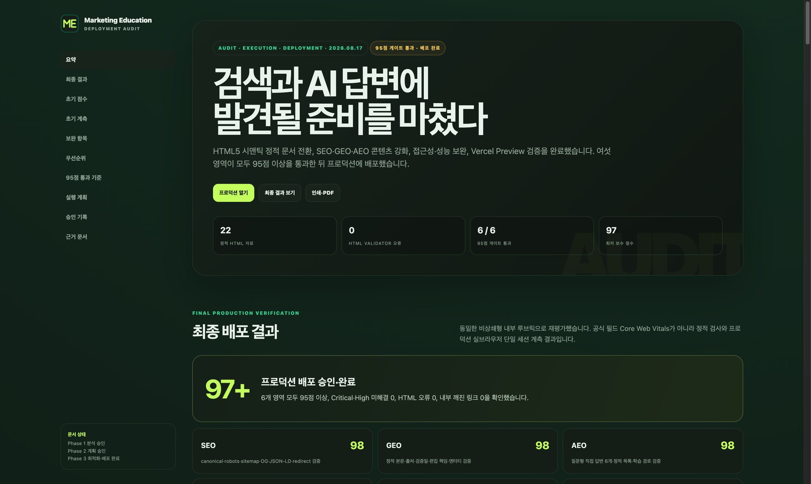

# GAS-Optimizer

[](https://github.com/Deuk1718/GAS-Optimizer/actions/workflows/validate.yml)
[](LICENSE)
[](https://github.com/Deuk1718/GAS-Optimizer/releases)

GAS-Optimizer는 정적 HTML, SSG, SSR 웹사이트를 **SEO, GEO, AEO, 접근성, 성능, 배포 준비도** 관점에서 분석하고 최적화하는 공개 표준 [Agent Skills](https://agentskills.io/) 패키지입니다.

여기서 GAS는 **GEO · AEO · SEO**를 뜻하며 Google Apps Script와는 관계가 없습니다.

## 핵심 특징

- 6개 품질 영역을 각각 100점으로 평가
- 모든 영역이 개별적으로 95점 이상이어야 통과
- 평균 점수로 부족한 영역을 보완하지 않는 비보상식 게이트
- Critical·High 문제, HTML 검증 오류, 주요 기능 회귀, 허위 구조화 데이터가 있으면 통과 차단
- 측정할 수 없는 필수 항목을 임의로 통과시키지 않고 `[blocked]`로 기록
- Google, Bing, schema.org 및 웹 표준의 공식 자료를 우선 사용
- 크롤링 가능한 초기 HTML과 점진적 향상 원칙 적용
- 분석 승인과 구현 계획 승인을 분리한 2단계 승인
- 최적화 전 백업·체크섬·롤백 계획
- 기능·시각 회귀와 주장·외부 링크·JSON-LD 진실성 검사
- 독립 실행 가능한 동적 HTML 분석 보고서 템플릿 제공

## HTML 분석 보고서 예시

아래 화면은 GAS-Optimizer 워크플로를 실제 **Marketing Education** 프로젝트에 적용해 작성한 `analysis-plan.html` 보고서입니다. 단순 목업이 아니라 초기 분석, 두 단계 승인, 최적화, 검증, 배포 결과까지 기록한 실제 사용 예시입니다.

[](docs/images/marketing-edu-analysis-report.jpg)

보고서는 한 HTML 파일 안에서 다음 정보를 함께 관리합니다.

- 최적화 전·후 6개 영역 점수와 비상쇄형 95점 게이트
- 정적 계측 증거, 평가 기준, 필터 가능한 보완 항목
- 우선순위, 해석상 주의사항, 단계별 실행 계획과 수용 기준
- 파일별 변경 범위, 검증 결과, 백업·롤백 정보
- 분석·계획 승인 기록과 선택형 외부 작업 상태

원본 템플릿은 [`analysis-plan-template.html`](skill/gas-optimizer/assets/analysis-plan-template.html)에 있으며 외부 스타일시트나 스크립트 없이 단독으로 동작합니다. 필터·상태 갱신 등은 HTML 안의 인라인 JavaScript로 처리합니다.

## 산출물 저장 위치

측정·디렉터리 생성 전에 스킬이 보고서와 원본 증거의 절대 경로를 표시하고 사용자 확인을 받습니다.

**분석 보고서 (`analysis-plan.html`)**

- 프로젝트 루트에 `docs`, `Docs`, `documentation`, `Documentation` 중 **하나만** 있으면 `<해당 디렉터리>/gas-optimizer/analysis-plan.html`에 저장합니다.
- 후보가 없으면 기본값은 `docs/gas-optimizer/analysis-plan.html`입니다.
- 후보가 둘 이상이면 사용자가 사용할 문서 디렉터리를 선택합니다.
- 이미 보고서가 있으면 이어서 작성, 새로 만들기, 사용자 지정 경로, 취소 중에서 선택합니다.

**원본 증거 패키지**

- 기본 위치: `.gas-optimizer/evidence/<run-id>/`
- 구조: `manifest.json`, `baseline/<category>/`(측정 전), `final/<category>/`(최적화 후). baseline은 final로 덮어쓰지 않습니다.
- 같은 run-id 디렉터리가 있으면 병합·덮어쓰지 않고 새 run-id를 만들어 경로를 다시 확인합니다.
- 비밀번호·토큰·쿠키·개인정보 등은 저장 전에 제거(또는 생략)하고, manifest에 기록합니다.

**경로 확인과 재정의(현재 실행만)**

확인 화면에서 네 가지 중 하나를 선택합니다: 기본값 사용, 보고서 경로만 변경, 증거 경로만 변경, 둘 다 변경. 상대 사용자 지정 경로는 `<project-root>`를 기준으로 해석합니다. 재정의는 **이번 실행에만** 적용되며 별도 설정 파일은 만들지 않습니다. 잘못되거나 쓸 수 없는 경로는 조용히 대체하지 않고, 다른 위치를 고를 때까지 `[blocked]`로 남깁니다.

프로젝트 밖의 사용자 지정 절대 경로는 로컬·호스트 파일시스템 정보가 보고서에 노출될 수 있다는 경고 후, 호스트가 해당 위치에 쓸 수 있는지 확인한 뒤에만 허용합니다. 프로젝트 내부 경로는 보고서에 상대 경로로 저장합니다.

**Git과 로컬 생성물**

보고서와 `.gas-optimizer/` 증거는 프로젝트에서 생성된 로컬 산출물입니다. Git 추적·무시 여부는 프로젝트의 `.gitignore` 등 정책을 따르며, 스킬이 자동으로 커밋하거나 제외하지 않습니다.

## 품질 게이트

아래 여섯 영역이 **모두 95점 이상**이어야 합니다.

1. SEO
2. GEO
3. AEO
4. 접근성
5. 성능
6. 배포 준비도

공통 평가 기준은 [`quality-rubric.md`](skill/gas-optimizer/references/quality-rubric.md)에 있습니다. 프로젝트별 조건을 추가할 수 있지만 공통 기준이나 통과선을 낮출 수는 없습니다.

## 기본 실행 흐름

1. 프로젝트와 렌더링 결과 조사
2. 6개 영역의 증거 기반 분석
3. 동적 `analysis-plan.html` 보고서 생성
4. 사용자에게 분석 승인 요청
5. 파일별 구현·검증·백업 계획 작성
6. 사용자에게 계획 승인 요청
7. 승인 후 백업과 최적화 실행
8. 기능·시각·링크·스키마 회귀 검사
9. 6개 영역을 다시 측정하고 통과할 때까지 반복
10. 품질 게이트 결과와 롤백 방법 보고

## 선택형 확장 기능

다음 기능은 기본적으로 실행되지 않습니다. GAS-Optimizer는 먼저 필요성, 변경 대상, 외부 영향, 되돌리는 방법을 설명하고 사용자가 개별 승인한 항목만 수행합니다.

### 최적화 전에 선택 가능

- Git 버전 관리
- 항목별 전용 증거 원장
- 대규모 사이트 페이지 유형 표본화

### 95점 게이트 통과 후 선택 가능

- Vercel Preview·Production 배포
- Google Search Console 속성 등록, 소유권 확인, 사이트맵 제출, 제출 후 검증
- Bing Webmaster Tools 사이트 등록, 네이티브 소유권 확인, Search Console 가져오기, 사이트맵 제출, IndexNow 알림
- Naver Search Advisor 호스트 등록, 소유권 확인, 사이트맵·RSS 제출, IndexNow 알림, 선택적 수동 수집 요청

### 외부 작업 실행 수준

외부 서비스에서 동일한 경험을 제공한다는 말은 자동화 가능성이 항상 같다는 뜻이 아닙니다. 모든 환경에서 same preflight, execution-level decision, status vocabulary, evidence standard, manual handoff를 적용한다는 뜻입니다. 공식 API나 MCP가 없거나 인증 상태를 안전하게 확인할 수 없으면 자동 실행 대신 검증 가능한 인계 또는 차단 상태로 기록합니다.

- **Level 1 · official API/MCP**: 사용자가 승인한 provider/action에 대해 공식 API, MCP, 또는 공식 지원 통합으로 실행하고 provider confirmation과 증거를 남길 수 있을 때만 사용합니다.
- **Level 2 · authenticated browser**: 사용자가 직접 login, 2FA, CAPTCHA를 완료한 뒤의 세션에서만 보조합니다. credentials, recovery, 2FA secrets are never requested or stored.
- **Level 3 · verifiable handoff**: 안전한 자동 실행이 불가능하지만 공식 목적지, 정확한 값, 검증 단계, 예상 성공 상태, 재시도·롤백을 제공할 수 있으면 `manual-required`로 남깁니다.
- **Level 4 · blocked**: 필수 권한, 소유권, 안전한 도구, 검증 가능한 증거, 또는 provider 조건이 없으면 차단합니다.

`quality-gate`는 SEO, GEO, AEO, 접근성, 성능, 배포 준비도 6개 핵심 점수의 비상쇄형 95점 통과 여부만 판단합니다. 외부 capability 때문에 core 95 scores는 절대 오르거나 내려가지 않습니다. `external-operations-gate`는 선택형 외부 작업의 별도 결과이며, 가이드만 제공한 상태는 완료가 아닙니다. 수동 인계는 `manual-required`로 기록하고, manual handoff alone remains `manual-required` and is not complete. 사용자가 완료 증거를 제공하거나 관찰 가능한 provider confirmation이 있어야 completed 또는 verified로 바꿀 수 있습니다.

Google, Bing, Naver 같은 post-95 optional provider도 provider/action-specific approval을 각각 받아야 합니다. 등록과 소유권 확인도 서로 다른 작업입니다. Bing Search Console 가져오기는 별도의 사용자 Google 승인이 필요하며 다른 작업과 묶을 수 없습니다. 각 등록, 확인, 제출, 알림, 가져오기, 수동 수집 요청은 서로 다른 승인·증거·롤백 단위입니다.

한 기능의 승인은 다른 외부 작업의 승인을 의미하지 않습니다.

## 공식 지원 환경

| 설치 대상 | 사용하는 환경 | 사용자 설치 위치 | 프로젝트 설치 위치 |
|---|---|---|---|
| `aside` | Aside | `<Aside account root>/skills/user/gas-optimizer` | 지원하지 않음 |
| `claude` | Claude Code | `~/.claude/skills/gas-optimizer` | `.claude/skills/gas-optimizer` |
| `agents` | Codex, Cursor, GitHub Copilot | `~/.agents/skills/gas-optimizer` | `.agents/skills/gas-optimizer` |

macOS, Linux, Windows 설치를 지원합니다. Claude.ai, Claude API, OpenAI API처럼 파일 업로드가 필요한 환경에는 Release의 `gas-optimizer-v1.2.1.zip`을 사용할 수 있습니다.

## 호출 방법

모든 환경에는 두 가지 호출 개념이 있습니다.

1. **자동 호출**: 요청 내용이 스킬 설명과 일치할 때 호스트가 자동으로 선택
2. **명시적 호출**: 사용자가 스킬 이름을 직접 선택하거나 입력

슬래시는 명시적 호출의 한 형태일 뿐이며 환경마다 문법이 다릅니다.

| 환경 | 명시적 호출 |
|---|---|
| Aside | `gas-optimizer 스킬을 사용해서 분석해줘` |
| Claude Code | `/gas-optimizer` |
| Codex CLI·IDE | `$gas-optimizer`, 또는 `/skills`에서 선택 |
| ChatGPT Skills | `@gas-optimizer` 선택 |
| Cursor | `/gas-optimizer` |
| GitHub Copilot | `/gas-optimizer` |
| API | 요청에 skill ID 또는 번들 연결 |

자세한 내용과 자동 호출 예시는 [`docs/INVOCATION.md`](docs/INVOCATION.md)를 참고하십시오.

## 요구 사항

- 지원 대상 Agent Skills 호스트 중 하나
- 전체 워크플로에는 프로젝트 파일 읽기·쓰기와 빌드·검증 명령 실행 기능 필요
- 브라우저, 네트워크, Git, 배포 도구가 없는 환경에서는 해당 검사가 `[blocked]` 또는 수동 단계로 남을 수 있음
- Aside 대상은 Aside를 한 번 실행하여 계정 폴더가 생성되어 있어야 함

## 패키지 매니저 설치

패키지 매니저는 실행기와 버전 고정 스킬 번들만 설치합니다. Package managers install only launcher files and package metadata; they must not create, update, back up, or remove user or project skill directories.

실제 호스트 복사는 두 번째 단계에서 사용자가 대상과 범위를 고른 뒤에만 이루어집니다.

macOS Homebrew:

```bash
brew tap deuk1718/tap
brew install deuk1718/tap/gas-optimizer
gas-optimizer install
```

Windows Scoop:

```powershell
scoop bucket add gas-optimizer https://github.com/Deuk1718/scoop-gas-optimizer
scoop install gas-optimizer
gas-optimizer install
```

CLI 계약:

```text
gas-optimizer install
gas-optimizer status
gas-optimizer sync
gas-optimizer uninstall
gas-optimizer version
```

- `gas-optimizer install`은 대상과 범위를 받은 뒤 기존 설치기에 명시적 플래그를 전달합니다.
- `gas-optimizer status`는 패키지 버전과 기록된 복사본의 `installedVersion` 차이를 보여 줍니다.
- `gas-optimizer sync`는 패키지 업그레이드 후 기록된 설치만 백업하고 다시 복사합니다. 자동으로 동기화하지 않습니다.
- `gas-optimizer uninstall`은 기록된 대상을 선택한 뒤 확인을 받고 백업 후 제거합니다. Homebrew/Scoop 제거는 사용자·프로젝트 스킬 복사본을 지우지 않습니다.
- 설치 기록은 `$GAS_OPTIMIZER_HOME/installations.json`에 저장되며, 기본값은 `~/.gas-optimizer/installations.json`입니다. 문서 형식은 `schemaVersion` 1입니다.

생성된 Homebrew Formula와 Scoop manifest를 tap/bucket 저장소에 올리는 일은 릴리스 채널 작업입니다. 사용자 홈 디렉터리를 바꾸지 않습니다. 태그를 만든 뒤에는 `./scripts/publish-package-channels.sh vX.Y.Z`를 실행하거나, 릴리스 워크플로 비밀 `PACKAGE_CHANNEL_TOKEN`을 설정해 자동으로 반영합니다.

WinGet 매니페스트는 릴리스 빌드에 포함됩니다. 공식 카탈로그 등록은 `microsoft/winget-pkgs`에 `Deuk1718.GASOptimizer` 매니페스트를 제출하는 별도 작업입니다. 로컬에서는 생성된 YAML 디렉터리로 설치할 수 있습니다.

```powershell
winget install --manifest dist/packaging/winget
```

Git clone 후 `install.sh`/`install.ps1`를 실행하는 방식은 그대로 지원합니다.

## macOS·Linux 설치

```bash
git clone --branch v1.2.1 --depth 1 https://github.com/Deuk1718/GAS-Optimizer.git
cd GAS-Optimizer
chmod +x install.sh uninstall.sh installers/*.sh scripts/build-release.sh bin/gas-optimizer
```

사용자 범위 설치:

```bash
./install.sh --target aside --scope user
./install.sh --target claude --scope user
./install.sh --target agents --scope user
./install.sh --target all --scope user
```

프로젝트 범위 설치:

```bash
./install.sh --target agents --scope project --project-root /path/to/project
./install.sh --target claude --scope project --project-root /path/to/project
./install.sh --target all --scope project --project-root /path/to/project
```

`all` 프로젝트 설치는 Claude와 공통 Agent Skills 위치를 설치합니다. Aside는 계정 범위만 지원합니다.

## Windows 설치

PowerShell에서 실행합니다.

```powershell
git clone --branch v1.2.1 --depth 1 https://github.com/Deuk1718/GAS-Optimizer.git
Set-Location GAS-Optimizer
```

사용자 범위 설치:

```powershell
powershell -NoProfile -ExecutionPolicy Bypass -File .\install.ps1 -Target Aside -Scope User
powershell -NoProfile -ExecutionPolicy Bypass -File .\install.ps1 -Target Claude -Scope User
powershell -NoProfile -ExecutionPolicy Bypass -File .\install.ps1 -Target Agents -Scope User
powershell -NoProfile -ExecutionPolicy Bypass -File .\install.ps1 -Target All -Scope User
```

프로젝트 범위 설치:

```powershell
powershell -NoProfile -ExecutionPolicy Bypass -File .\install.ps1 -Target All -Scope Project -ProjectRoot "C:\path\to\project"
```

PowerShell 7에서는 `powershell` 대신 `pwsh`를 사용할 수 있습니다. `-ExecutionPolicy Bypass`는 해당 프로세스에만 적용되며 시스템 정책을 영구 변경하지 않습니다.

## Git 없이 설치

[GitHub Releases](https://github.com/Deuk1718/GAS-Optimizer/releases/latest)에서 Source code 압축 파일을 내려받아 압축을 푼 뒤 위 설치기를 실행합니다.

Claude.ai 또는 API 업로드에는 별도 Release 자산인 다음 파일을 사용합니다.

```text
gas-optimizer-v1.2.1.zip
SHA256SUMS.txt
```

## 설치 동작과 업데이트

설치기는 공통 원본인 `skill/gas-optimizer`를 선택한 위치에 복사합니다. 기존 설치가 있으면 덮어쓰기 전에 자동 백업하며 심볼릭 링크는 교체하지 않습니다.

패키지 매니저로 올린 뒤에는 `gas-optimizer sync`로 기록된 복사본만 갱신합니다. Git clone 설치기는 새 태그를 내려받은 뒤 같은 대상과 범위로 다시 실행하면 됩니다. 설치 후 호스트가 즉시 발견하지 못하면 해당 앱이나 세션을 다시 시작하십시오.

## 제거

macOS·Linux:

```bash
./uninstall.sh --target agents --scope user --yes
./uninstall.sh --target all --scope project --project-root /path/to/project --yes
```

Windows:

```powershell
powershell -NoProfile -ExecutionPolicy Bypass -File .\uninstall.ps1 -Target Agents -Scope User -Yes
```

제거할 때도 현재 설치본을 먼저 백업합니다.

## 사용 예시

자동 호출을 유도하는 일반 요청:

```text
이 SSR 프로젝트의 SEO, GEO, AEO, 접근성, 성능과 배포 준비도를 각각 평가해줘. 우선 분석만 진행해줘.
```

플랫폼에 관계없이 통하는 명시적 요청:

```text
GAS-Optimizer 스킬을 사용해서 이 프로젝트를 분석해줘. 아직 파일은 수정하지 마.
```

스킬은 먼저 분석 보고서를 만들고 승인을 요청합니다. 명시적으로 호출해도 분석 승인과 계획 승인 단계는 생략되지 않습니다.

## 저장소 구성

```text
GAS-Optimizer/
├── README.md
├── LICENSE
├── VERSION
├── bin/gas-optimizer
├── bin/gas-optimizer.ps1
├── bin/gas-optimizer.cmd
├── install.sh / install.ps1
├── uninstall.sh / uninstall.ps1
├── installers/
├── packaging/
│   ├── homebrew/gas-optimizer.rb.in
│   └── scoop/gas-optimizer.json.in
├── scripts/
├── docs/
│   ├── INVOCATION.md
│   └── images/marketing-edu-analysis-report.jpg
├── .github/workflows/
└── skill/gas-optimizer/
    ├── SKILL.md
    ├── references/
    │   ├── quality-rubric.md
    │   ├── capability-matrix.md
    │   ├── external-search-operations.md
    │   └── search-engines/
    └── assets/analysis-plan-template.html
```

## 보안과 한계

- 기존 설치는 덮어쓰기와 제거 전에 자동 백업합니다.
- 심볼릭 링크 또는 예상과 다른 스킬은 자동으로 교체·제거하지 않습니다.
- Release ZIP에는 SHA-256 체크섬을 제공합니다.
- 설치 스크립트를 인터넷에서 바로 파이프로 실행하는 방식은 권장하지 않습니다.
- 호스트가 필요한 도구를 제공하지 않으면 관련 검사는 통과가 아니라 `[blocked]`입니다.
- 점수는 검색 순위, 트래픽, AI 인용 또는 색인 등록을 보장하지 않습니다.
- 실제 배포, GitHub 푸시, Search Console, Bing 등록은 사용자가 선택하고 승인한 경우에만 수행합니다.

## 라이선스

[MIT License](LICENSE)로 공개합니다.

---

**English summary:** GAS-Optimizer is an open-standard Agent Skill for evidence-based SEO, GEO, AEO, accessibility, performance, and deployment-readiness optimization. Each domain must independently score at least 95/100. Aside, Claude Code, Codex, Cursor, and GitHub Copilot installation paths are supported on macOS, Linux, and Windows.
